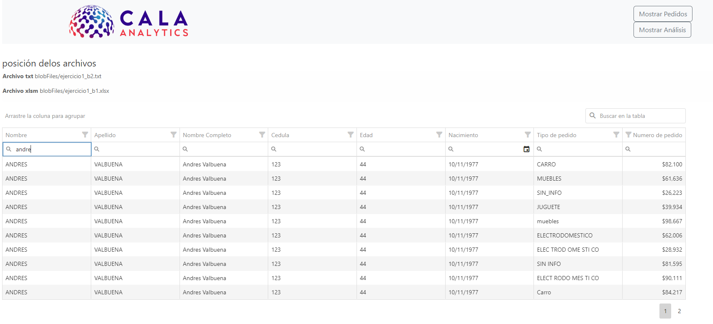
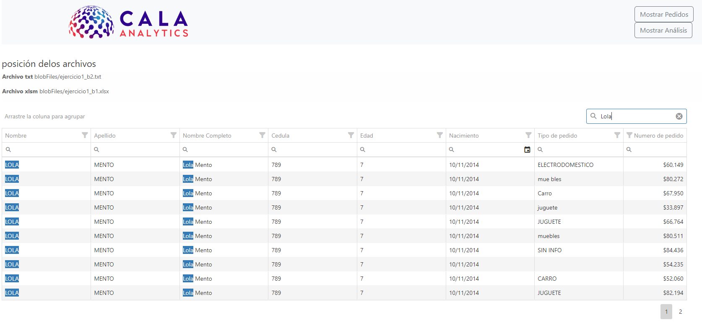
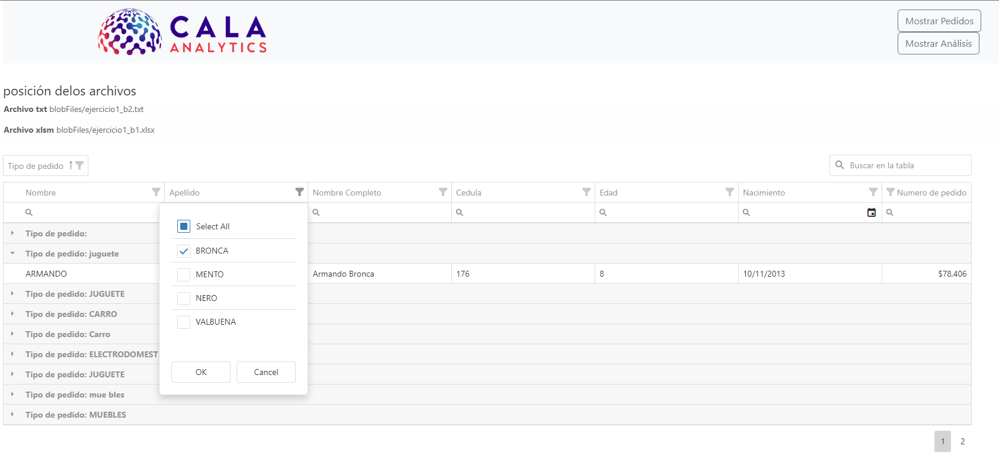

# Prueba técnica CALA analitic

la siguiente prueba consiste de dos partes

- API rest python flask
- FronEnd html y jquery

## consideraciones

antes de pensar debe verificar que su entorno virtual este activo
una vez este en ejecución debe instalar las dependencias requeridas para el proyecto
ejecute
`pip install -r requirements.txt`
de esta forma se instalarán las dependencias que la api requiere para su funcionamiento

## estructura

- `requirements.txt` en este archivo se encuentra la dependencia que el proyecto necesita
- `main.py` este archivo es el punto de arranque de nuestro api y aquí se encuentran las configuraciones necesarias
- `config.yaml` este archivo se encarga de nuestra configuración aquí se encuentran ubicado el nombre del almacenador de archivos (blob)
  y el nombre de los archivos (filesnames)
- `blobFiles` este folder se encentra los archivos
- `app` en este folder se encuentra la lógica de neutras aplicación se paradas por capas

```
   app
       -> models: en este folder se encuentra el modelo de respuestas
       -> services: se encuentra la lógica de nuestra aplicación se parada por servicios
       -> utils: son las utilidades que son repetitivas en nuestras aplicación o herramientas necesarias

```

- `fronend` este folder contiene nuestra aplicación web

  > Nota: nuestra aplicación web no está construida sobre ningún frameword por ende no requiere instalación

- imgs : son las imagenes de nuestra aplicacion en funcionamiento

## recursos gráficos

web inicial

- se muestra la posición de los archivos en el blob
  

- al hacer clic en Mostrar Pedidos se carga la tabla de datos
  

- filtrando datos
  
- buscador global
  
- agrupando columnas
  
- agrupando columnas y aplicando filtros
  
