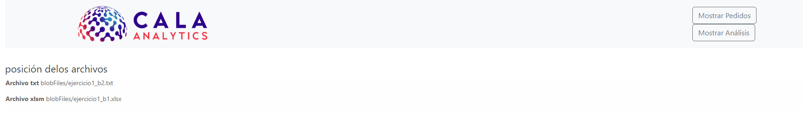
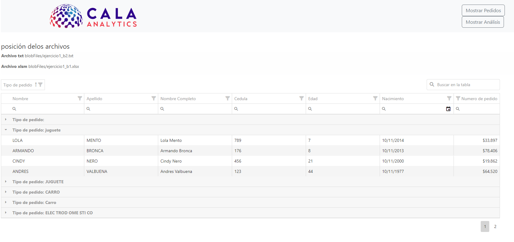

# Prueba técnica CALA analitic

la siguiente prueba consiste de dos partes

- API rest python flask
- FronEnd html y jquery

## consideraciones

antes de pensar debe verificar que su entorno virtual este activo
una vez este en ejecución debe instalar las dependencias requeridas para el proyecto
ejecute
`pip install -r requirements.txt`
de esta forma se instalarán las dependencias que la api requiere para su funcionamiento

## estructura

- `requirements.txt` en este archivo se encuentra la dependencia que el proyecto necesita
- `main.py` este archivo es el punto de arranque de nuestro api y aquí se encuentran las configuraciones necesarias
- `config.yaml` este archivo se encarga de nuestra configuración aquí se encuentran ubicado el nombre del almacenador de archivos (blob)
  y el nombre de los archivos (filesnames)
- `blobFiles` este folder se encentra los archivos
- `app` en este folder se encuentra la lógica de neutras aplicación se paradas por capas

```
   app
       -> models: en este folder se encuentra el modelo de respuestas
       -> services: se encuentra la lógica de nuestra aplicación se parada por servicios
       -> utils: son las utilidades que son repetitivas en nuestras aplicación o herramientas necesarias

```

- `fronend` este folder contiene nuestra aplicación web

  > Nota: nuestra aplicación web no está construida sobre ningún frameword por ende no requiere instalación

- imgs : son las imagenes de nuestra aplicacion en funcionamiento

## rutas api

- ip/v1/storage
- ip/v1/storage/chart
- ip/v1/storage/location
  > nota ip publica http://34.230.70.57/v1/storage/

## despliegue en aws

- nos dirigimos a apartado de maquinas virtuales EC2
- le damos clic en Lanzar una instancia
- - establecemos el nombre o etiqueta
- - seleccionamos Imágenes de aplicaciones y sistemas operativos
- - luego el tipo de instancia
- - Configuraciones de red le damos editar y adicionamos un grupo de seguridad que sería el tráfico que red que queremos para esta prueba se seleccionó todo el tráfico y origen cualquier lugar
- - para finalizar le damos clic en lanzar instancia se lanzara una modal para crear par de llave la cual al generar se descargaran archivo de extensión .pem

- para continuar necesitaremos de putty y puttygen
- - abrimos puttygen y cargamos nuestro archivo .pem para crear la clave privad de conexión, le damos en guardar y generara otro archivo .ppk
- - abrimos putty y le damos en SSH luego en AUTH donde dice prívate key file for authentication: cargamos el archivo anterior mente generado con puttygen
    -- luego damos clic en sesión y en el campo ip address ingresamos la dirección ip de nuestra maquina EC2 y luego clic en open
- - nos va a pedir ingresar nuestro usuario `ec2-user`
- - una ves conectados a nuestra maquina verificamos sino hay actualizaciones con `sudo yum update` en el caso de que sea requerido procedemos a actualizar los paquetes
- - instalaremos docker para nuestra aplicación para eso debemos ejecutar
    `sudo amazon-linux-extras install docker` también es necesario instalar git `sudo yum install git`
- - una vez instalado las utilidades del paso anterior procedemos a clonar nuestro repositorio
- - paso a seguir es darle permisos a docker para eso ejecutamos el siguiente comando
    `sudo usermod -a -G docker ec2-user` una ves ejecuta el comando cerramos la conexión con putty y volvemos a abrirla
- - nueva mente conectados a nuestro servidor vamos a construir nuestra imagen ejecutamos el comando `docker build -t flask_docker:v1 .`
- - cuando paso anterior haya terminado bindearemos nuestra ip para darle salida a nuestra aplicación ejecutamos el siguiente comando `docker run -d -p 80:5000 flask_docker:v1` esto dejara la ejecución en segundo plano

## recursos gráficos

web inicial

- se muestra la posición de los archivos en el blob
  

- al hacer clic en Mostrar Pedidos se carga la tabla de datos
  

- filtrando datos
  
- buscador global
  
- agrupando columnas
  
- agrupando columnas y aplicando filtros
  
